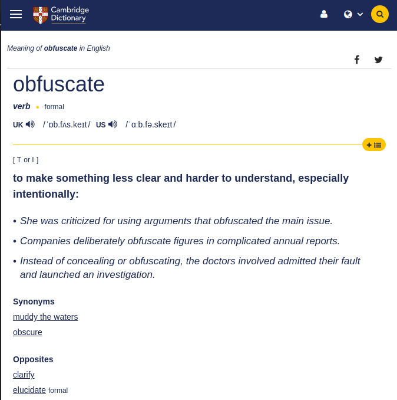
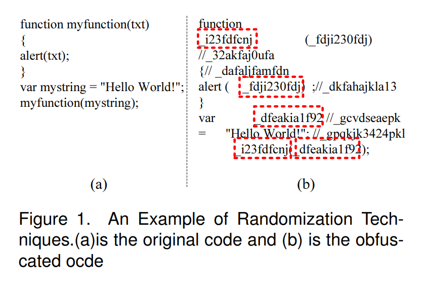
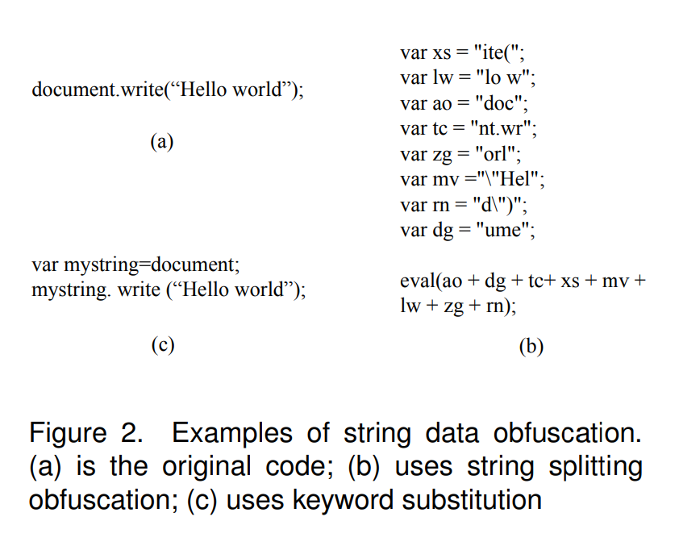
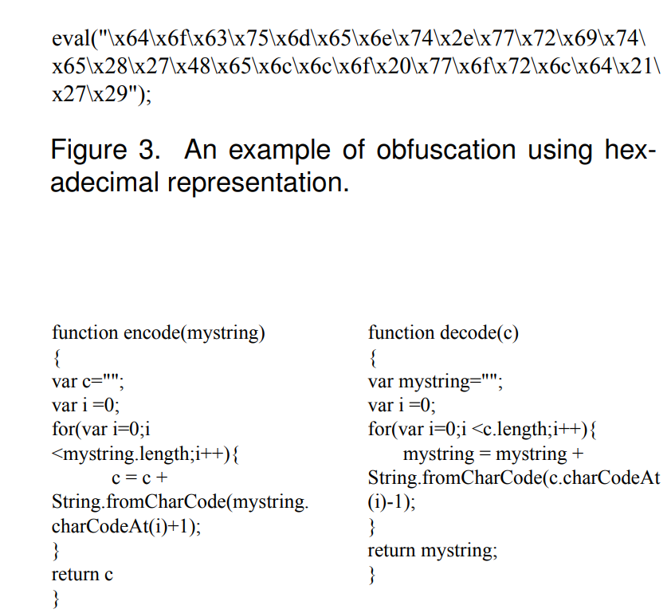
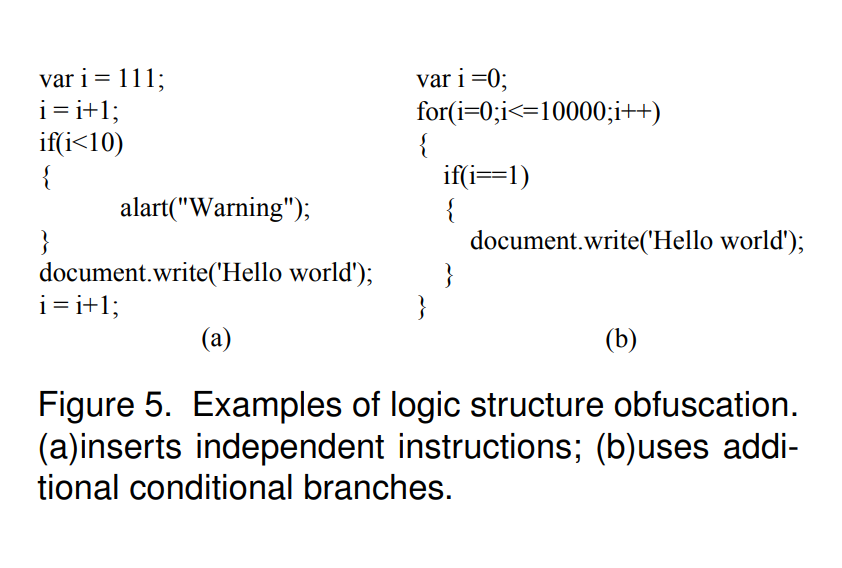
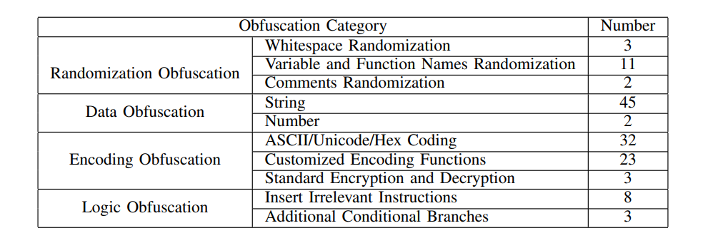
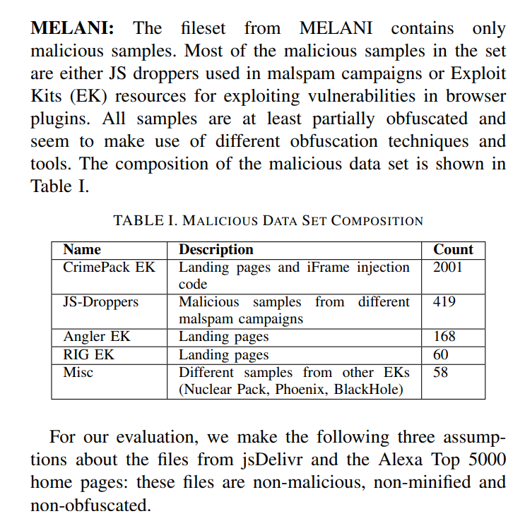
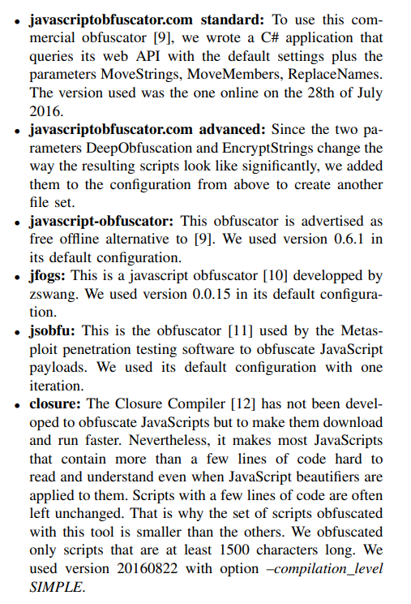
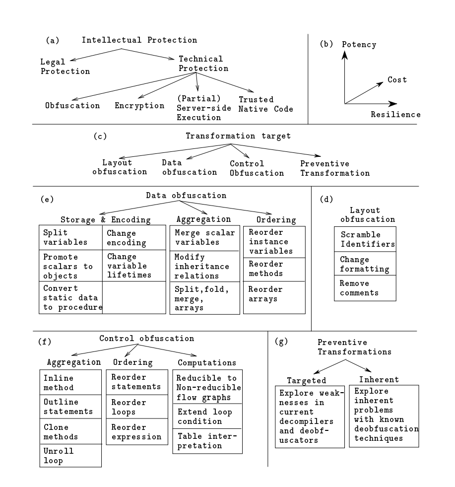

# Obfuscate

to make something less clear and harder to understand, especially intentionally.

# The Power of Obfuscation Techniques in Malicious JavaScript Code: A Measurement Study

Wei Xu, Fangfang Zhang and Sencun Zhu
Department of Computer Science and Engineering
The Pennsylvania State University, University Park
Email:{wxx104, fuz104, szhu}@cse.psu.edu

# Categorizing Observed Obfuscation Techniques

There are 4 Categories

## 1. Randomization Obfuscation

## 2. Data Obfuscation

## 3. Encoding Obfuscation

## 4. Logic Structure Obfuscation

# The usage of JavaScript Obfuscation Techniques

# Detecting Obfuscated JavaScripts from Known and Unknown Obfuscators using Machine Learning

Bernhard Tellenbach
Zurich University of Applied Sciences
Switzerland
Email: tebe@zhaw.ch

Sergio Paganoni
SecureSafe / DSwiss AG
Zurich, Switzerland
Email: sergio.paganoni@dswiss.com

Marc Rennhard
Zurich University of Applied Sciences
Switzerland
Email: rema@zhaw.ch

## MELANI (JS Droppers | Exploit Kits)

# Six different JavaScript Obfuscators

# A Taxonomy of Obfuscating Transformations

Christian Collberg Clark Thomborson Douglas Low

Technical Report #148

# Reverse Engineer

Given enough time, effort and determination, a competent programmer will always be able to reverse engineer any application. Having gained physical access to the application, the reverse engineer can decompile it (using disassemblers or decompilers) and then analyze its data structures and control ow. This can either be done manually or with the aid of reverse engineering tools such as program slicers.

